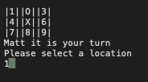

## Tic-Tac-Toe

### Author: Enrique Hilst

----

## Description

This is a console application that allows two players to play the game Tic Tac Toe.

---

### Getting Started

Clone this repository to your local machine.

```
git clone https://github.com/ehilst515/tic-tac-toe.git
```

Or interact with this project hosted online. The online compiler is much slower! Visit here:
<https://onlinegdb.com/BkW0jLXS7O>

### To run the program from Visual Studio

Select ```File``` -> ```Open``` -> ```Project/Solution```

Next navigate to the location you cloned the Repository.

Double click on the ```Tic-Tac-Toe``` directory.

Then select and open ```Tic-Tac-Toe.sln```

---

### Visuals




